# Flow diagrams

How the five services fit together, and what actually happens on a request.
Source of truth is the code; these diagrams point at it.

- [1. System topology](#1-system-topology)
- [2. Who talks to whom, and how](#2-who-talks-to-whom-and-how)
- [3. Login](#3-login)
- [4. Check-in (the full story)](#4-check-in-the-full-story)
- [5. The transactional outbox](#5-the-transactional-outbox)
- [6. Idempotent delivery in notification](#6-idempotent-delivery-in-notification)
- [7. Degradation and self-healing](#7-degradation-and-self-healing)
- [8. Check-out](#8-check-out)
- [9. The live SSE dashboard](#9-the-live-sse-dashboard)
- [10. Gateway guard chain](#10-gateway-guard-chain)
- [11. Error translation at the edge](#11-error-translation-at-the-edge)
- [12. Health check](#12-health-check)
- [13. Startup](#13-startup)

---

## 1. System topology

Five OS processes, four databases. Only the gateway speaks HTTP.

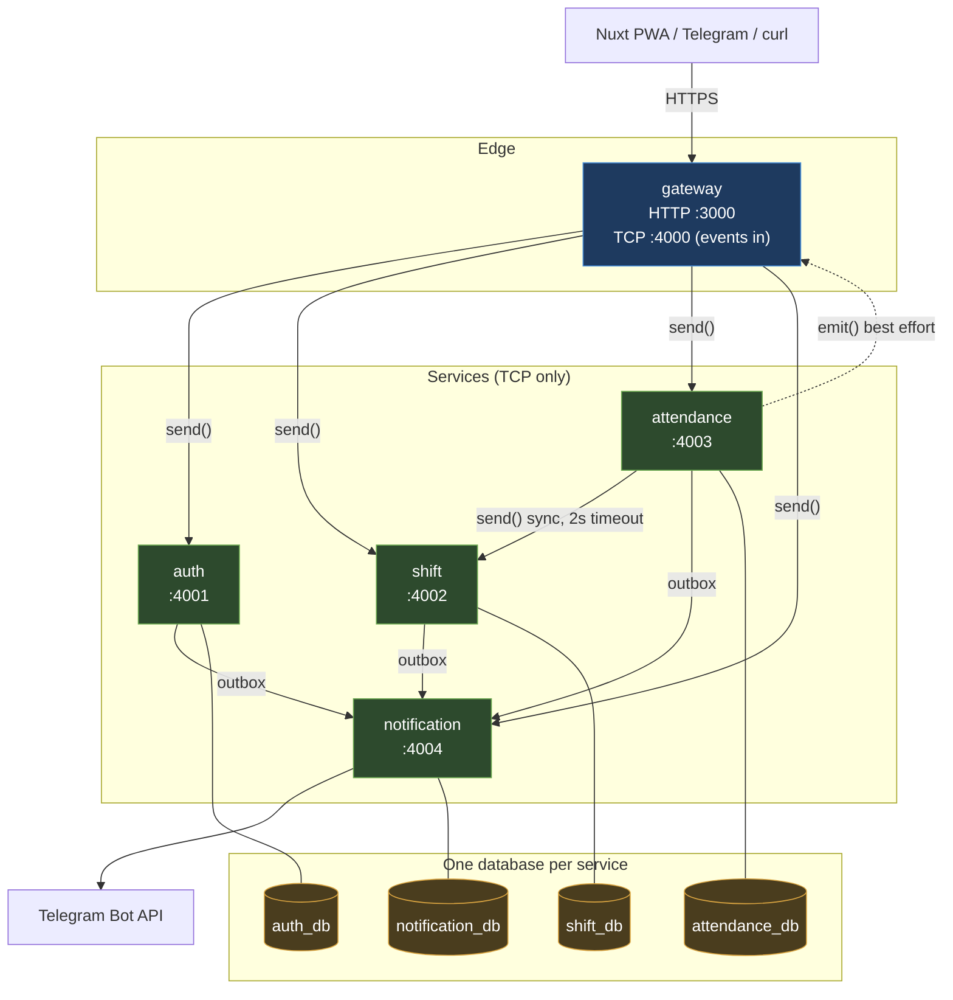
```mermaid
flowchart TB
    client["Nuxt PWA / Telegram / curl"]

    subgraph edge["Edge"]
        gw["gateway<br/>HTTP :3000<br/>TCP :4000 (events in)"]
    end

    subgraph svc["Services (TCP only)"]
        auth["auth<br/>:4001"]
        shift["shift<br/>:4002"]
        att["attendance<br/>:4003"]
        notif["notification<br/>:4004"]
    end

    subgraph db["One database per service"]
        authdb[("auth_db")]
        shiftdb[("shift_db")]
        attdb[("attendance_db")]
        notifdb[("notification_db")]
    end

    tg["Telegram Bot API"]

    client -->|HTTPS| gw
    gw -->|"send()"| auth
    gw -->|"send()"| shift
    gw -->|"send()"| att
    gw -->|"send()"| notif

    att -->|"send() sync, 2s timeout"| shift
    att -.->|"emit() best effort"| gw
    auth -->|outbox| notif
    shift -->|outbox| notif
    att -->|outbox| notif
    notif --> tg

    auth --- authdb
    shift --- shiftdb
    att --- attdb
    notif --- notifdb

    classDef gwc fill:#1e3a5f,stroke:#4a90d9,color:#fff
    classDef svcc fill:#2d4a2d,stroke:#6aa84f,color:#fff
    classDef dbc fill:#4a3d1e,stroke:#d9a441,color:#fff
    class gw gwc
    class auth,shift,att,notif svcc
    class authdb,shiftdb,attdb,notifdb dbc
```

**A service never reads another service's database.** `userId` in shift and
attendance is a plain UUID with no foreign key — the users table is in a
different database. The boundary is enforced by folder structure: each service
generates its Prisma client into `apps/<svc>/src/generated/prisma/`, so no other
app can import it (`apps/attendance/src/prisma.service.ts`).

---

## 2. Who talks to whom, and how

Three kinds of edge, and the difference matters more than anything else here.

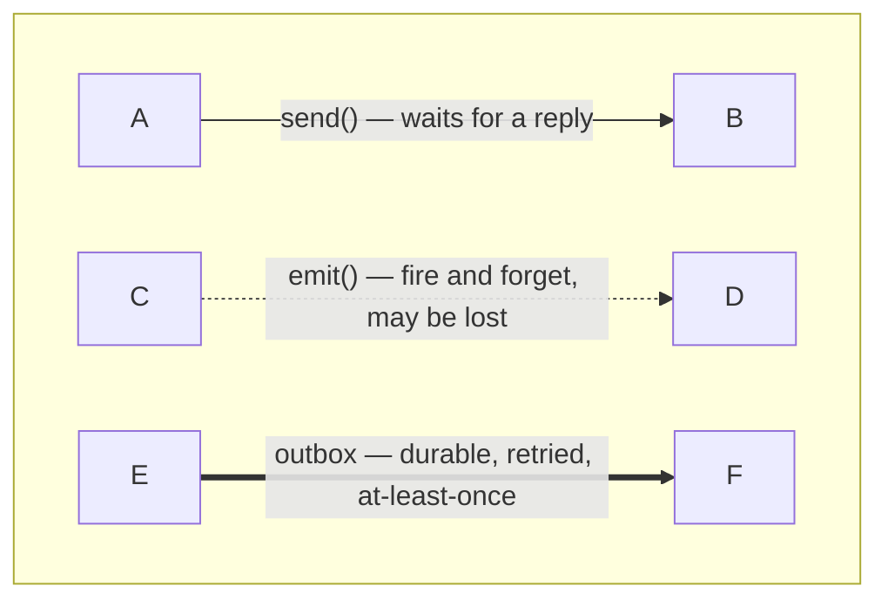
```mermaid
flowchart LR
    subgraph legend[" "]
        direction LR
        a1[A] -->|"send() — waits for a reply"| a2[B]
        b1[C] -.->|"emit() — fire and forget, may be lost"| b2[D]
        c1[E] ==>|"outbox — durable, retried, at-least-once"| c2[F]
    end
```

| Edge | Mechanism | If the target is down |
|---|---|---|
| gateway → any service | `client.send()` + 5s timeout | HTTP **503** / **504** to the caller |
| attendance → shift | `client.send()` + 2s timeout | check-in saved as `UNVERIFIED`, fixed later |
| any service → notification | outbox relay, `send()` + backoff | event waits in the publisher's DB, retried |
| attendance → gateway | `publish()` = `emit()` | event is **lost**, on purpose |

Pattern names live in `libs/common/src/patterns.ts`, event names in
`libs/common/src/events.ts`. Those two files are the entire inter-service API.

---

## 3. Login

The important part is what happens *after*: the gateway verifies every later
token locally and never calls auth again.

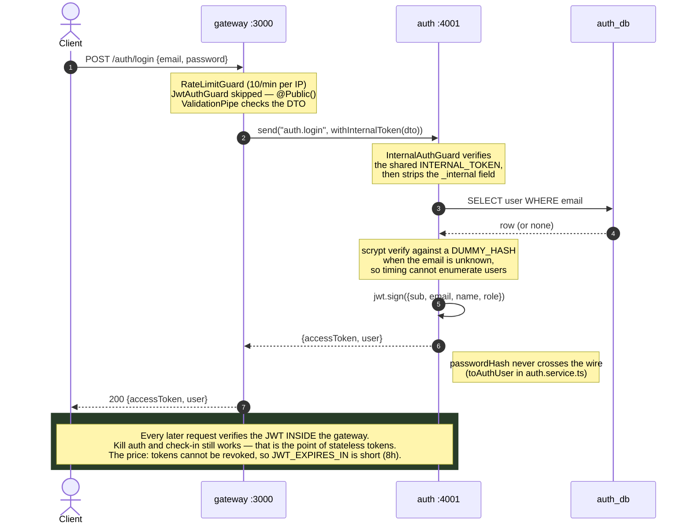
```mermaid
sequenceDiagram
    autonumber
    actor U as Client
    participant GW as gateway :3000
    participant A as auth :4001
    participant DB as auth_db

    U->>GW: POST /auth/login {email, password}
    Note over GW: RateLimitGuard (10/min per IP)<br/>JwtAuthGuard skipped — @Public()<br/>ValidationPipe checks the DTO
    GW->>A: send("auth.login", withInternalToken(dto))
    Note over A: InternalAuthGuard verifies<br/>the shared INTERNAL_TOKEN,<br/>then strips the _internal field
    A->>DB: SELECT user WHERE email
    DB-->>A: row (or none)
    Note over A: scrypt verify against a DUMMY_HASH<br/>when the email is unknown,<br/>so timing cannot enumerate users
    A->>A: jwt.sign({sub, email, name, role})
    A-->>GW: {accessToken, user}
    Note right of A: passwordHash never crosses the wire<br/>(toAuthUser in auth.service.ts)
    GW-->>U: 200 {accessToken, user}

    rect rgb(40,60,40)
    Note over U,A: Every later request verifies the JWT INSIDE the gateway.<br/>Kill auth and check-in still works — that is the point of stateless tokens.<br/>The price: tokens cannot be revoked, so JWT_EXPIRES_IN is short (8h).
    end
```

---

## 4. Check-in (the full story)

One request that exercises every pattern in the system.
Code: `apps/attendance/src/attendance.service.ts`.

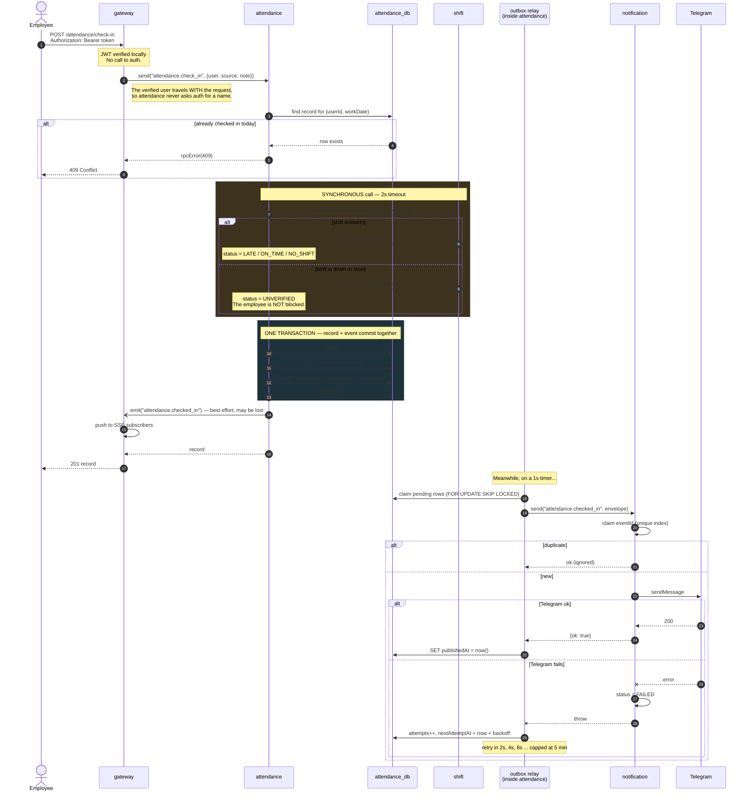
```mermaid
sequenceDiagram
    autonumber
    actor U as Employee
    participant GW as gateway
    participant AT as attendance
    participant ADB as attendance_db
    participant SH as shift
    participant RL as outbox relay<br/>(inside attendance)
    participant NO as notification
    participant TG as Telegram

    U->>GW: POST /attendance/check-in<br/>Authorization: Bearer token
    Note over GW: JWT verified locally.<br/>No call to auth.
    GW->>AT: send("attendance.check_in", {user, source, note})
    Note right of GW: The verified user travels WITH the request,<br/>so attendance never asks auth for a name.

    AT->>ADB: find record for (userId, workDate)
    alt already checked in today
        ADB-->>AT: row exists
        AT-->>GW: rpcError(409)
        GW-->>U: 409 Conflict
    end

    rect rgb(60,50,30)
    Note over AT,SH: SYNCHRONOUS call — 2s timeout
    AT->>SH: send("shift.resolve_for_user", {userId, at})
    alt shift answers
        SH-->>AT: ResolvedShift or null
        Note over AT: status = LATE / ON_TIME / NO_SHIFT
    else shift is down or slow
        SH--xAT: timeout / ECONNREFUSED
        Note over AT: status = UNVERIFIED<br/>The employee is NOT blocked.
    end
    end

    rect rgb(30,50,60)
    Note over AT,ADB: ONE TRANSACTION — record + event commit together
    AT->>ADB: BEGIN
    AT->>ADB: INSERT AttendanceRecord
    AT->>ADB: INSERT OutboxEvent (attendance.checked_in)
    AT->>ADB: COMMIT
    end

    AT-)GW: emit("attendance.checked_in") — best effort, may be lost
    GW->>GW: push to SSE subscribers
    AT-->>GW: record
    GW-->>U: 201 record

    Note over RL: Meanwhile, on a 1s timer...
    RL->>ADB: claim pending rows (FOR UPDATE SKIP LOCKED)
    RL->>NO: send("attendance.checked_in", envelope)
    NO->>NO: claim eventId (unique index)
    alt duplicate
        NO-->>RL: ok (ignored)
    else new
        NO->>TG: sendMessage
        alt Telegram ok
            TG-->>NO: 200
            NO-->>RL: {ok: true}
            RL->>ADB: SET publishedAt = now()
        else Telegram fails
            TG--xNO: error
            NO->>NO: status = FAILED
            NO--xRL: throw
            RL->>ADB: attempts++, nextAttemptAt = now + backoff
            Note over RL: retry in 2s, 4s, 8s ... capped at 5 min
        end
    end
```

### Why the transaction matters

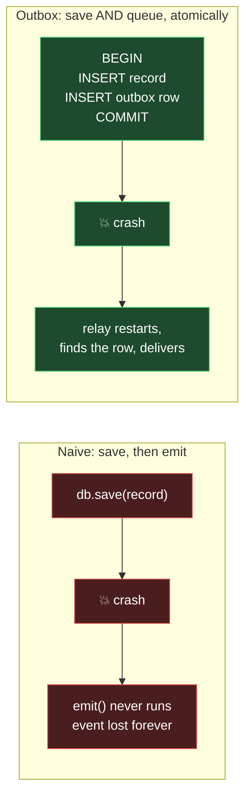
```mermaid
flowchart LR
    subgraph bad["Naive: save, then emit"]
        direction TB
        b1["db.save(record)"] --> b2["💥 crash"] --> b3["emit() never runs<br/>event lost forever"]
    end

    subgraph good["Outbox: save AND queue, atomically"]
        direction TB
        g1["BEGIN<br/>INSERT record<br/>INSERT outbox row<br/>COMMIT"] --> g2["💥 crash"] --> g3["relay restarts,<br/>finds the row, delivers"]
    end

    classDef badc fill:#4a1e1e,stroke:#d94a4a,color:#fff
    classDef goodc fill:#1e4a2d,stroke:#4ad97a,color:#fff
    class b1,b2,b3 badc
    class g1,g2,g3 goodc
```

---

## 5. The transactional outbox

`libs/common/src/outbox.ts`. One relay runs inside every publishing service.

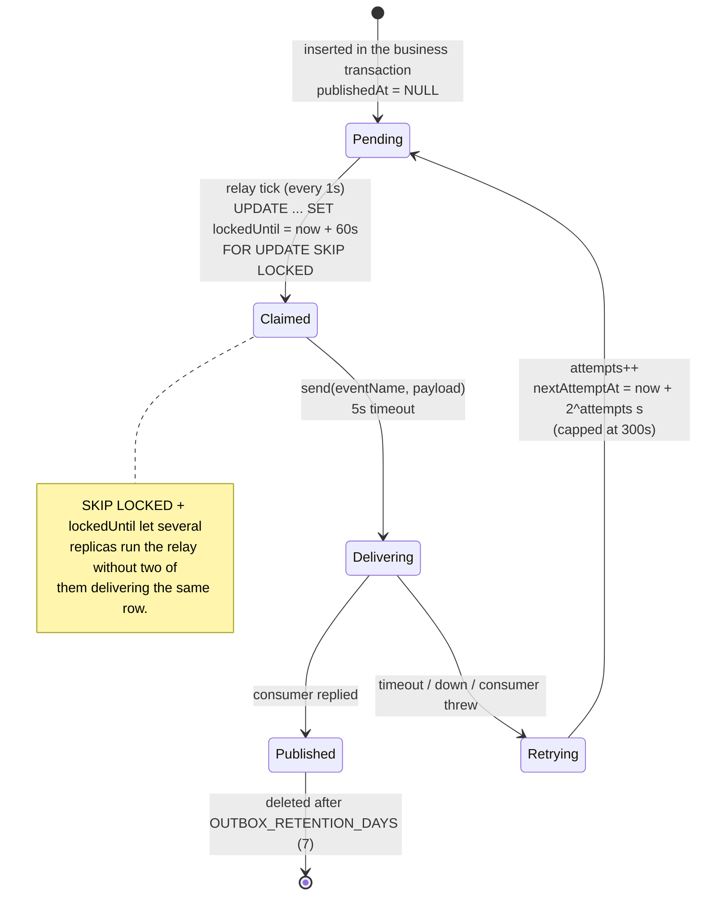
```mermaid
stateDiagram-v2
    [*] --> Pending: inserted in the business transaction<br/>publishedAt = NULL

    Pending --> Claimed: relay tick (every 1s)<br/>UPDATE ... SET lockedUntil = now + 60s<br/>FOR UPDATE SKIP LOCKED
    note right of Claimed
        SKIP LOCKED + lockedUntil let several
        replicas run the relay without two of
        them delivering the same row.
    end note

    Claimed --> Delivering: send(eventName, payload)<br/>5s timeout
    Delivering --> Published: consumer replied
    Delivering --> Retrying: timeout / down / consumer threw

    Retrying --> Pending: attempts++<br/>nextAttemptAt = now + 2^attempts s<br/>(capped at 300s)

    Published --> [*]: deleted after OUTBOX_RETENTION_DAYS (7)
```

The relay polls one query:

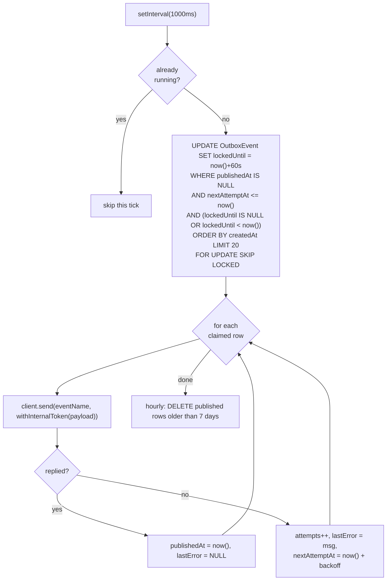
```mermaid
flowchart TB
    tick["setInterval(1000ms)"] --> guard{"already<br/>running?"}
    guard -->|yes| skip["skip this tick"]
    guard -->|no| claim["UPDATE OutboxEvent SET lockedUntil = now()+60s<br/>WHERE publishedAt IS NULL<br/>AND nextAttemptAt &lt;= now()<br/>AND (lockedUntil IS NULL OR lockedUntil &lt; now())<br/>ORDER BY createdAt LIMIT 20<br/>FOR UPDATE SKIP LOCKED"]
    claim --> loop{"for each<br/>claimed row"}
    loop --> deliver["client.send(eventName, withInternalToken(payload))"]
    deliver --> ok{"replied?"}
    ok -->|yes| mark["publishedAt = now(), lastError = NULL"]
    ok -->|no| back["attempts++, lastError = msg,<br/>nextAttemptAt = now() + backoff"]
    mark --> loop
    back --> loop
    loop -->|done| clean["hourly: DELETE published rows older than 7 days"]
```

**Consequence:** delivery is **at-least-once**, never exactly-once. A reply that
is lost on the way back makes the relay send the same event again. That is why
section 6 exists.

---

## 6. Idempotent delivery in notification

`apps/notification/src/notification.service.ts` → `deliver()`.
Every event carries an `eventId` (`envelope()` in `libs/common/src/events.ts`).

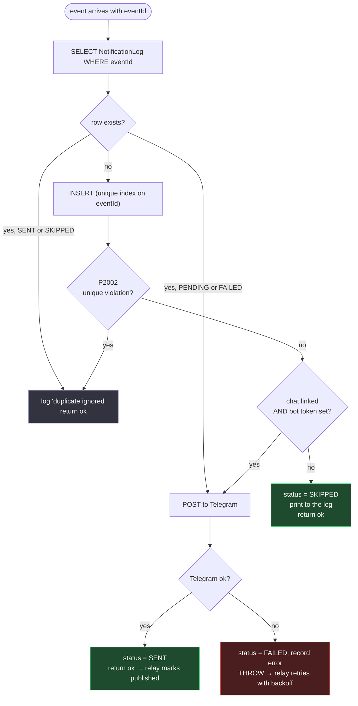
```mermaid
flowchart TB
    start(["event arrives with eventId"]) --> find["SELECT NotificationLog WHERE eventId"]
    find --> exists{"row exists?"}

    exists -->|"yes, SENT or SKIPPED"| dup["log 'duplicate ignored'<br/>return ok"]
    exists -->|"yes, PENDING or FAILED"| send
    exists -->|no| create["INSERT (unique index on eventId)"]

    create --> race{"P2002<br/>unique violation?"}
    race -->|yes| dup
    race -->|no| linked{"chat linked<br/>AND bot token set?"}

    linked -->|no| skipped["status = SKIPPED<br/>print to the log<br/>return ok"]
    linked -->|yes| send["POST to Telegram"]

    send --> result{"Telegram ok?"}
    result -->|yes| sent["status = SENT<br/>return ok → relay marks published"]
    result -->|no| failed["status = FAILED, record error<br/>THROW → relay retries with backoff"]

    classDef okc fill:#1e4a2d,stroke:#4ad97a,color:#fff
    classDef badc fill:#4a1e1e,stroke:#d94a4a,color:#fff
    classDef neutralc fill:#33333f,stroke:#8888aa,color:#fff
    class sent,skipped okc
    class failed badc
    class dup neutralc
```

The unique index on `eventId` is what makes at-least-once delivery safe.
A consumer that is not idempotent will double-send on every retry.

One event, two independent reactions — added without touching attendance:

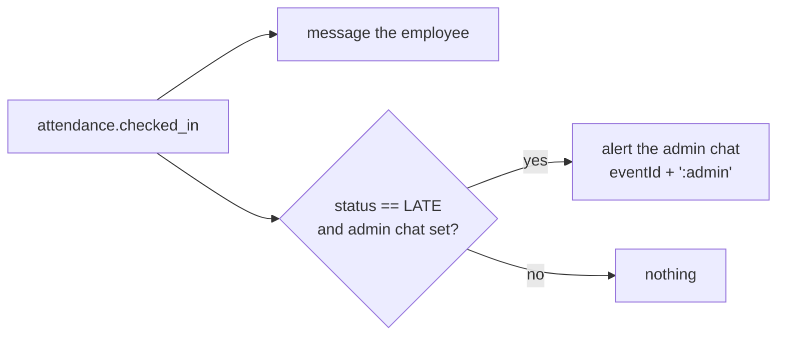
```mermaid
flowchart LR
    ev["attendance.checked_in"] --> r1["message the employee"]
    ev --> r2{"status == LATE<br/>and admin chat set?"}
    r2 -->|yes| r3["alert the admin chat<br/>eventId + ':admin'"]
    r2 -->|no| r4["nothing"]
```

---

## 7. Degradation and self-healing

What a check-in gets stored as, depending on what the shift service said:

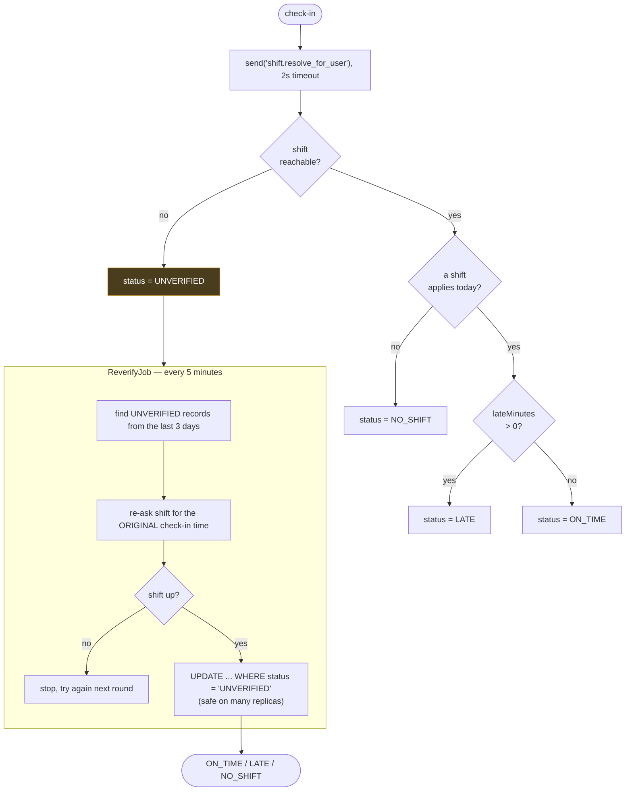
```mermaid
flowchart TB
    ci(["check-in"]) --> ask["send('shift.resolve_for_user'), 2s timeout"]
    ask --> reach{"shift<br/>reachable?"}

    reach -->|no| unv["status = UNVERIFIED"]
    reach -->|yes| has{"a shift<br/>applies today?"}

    has -->|no| nosh["status = NO_SHIFT"]
    has -->|yes| late{"lateMinutes<br/>&gt; 0?"}

    late -->|yes| lt["status = LATE"]
    late -->|no| ot["status = ON_TIME"]

    unv --> job

    subgraph job["ReverifyJob — every 5 minutes"]
        j1["find UNVERIFIED records from the last 3 days"] --> j2["re-ask shift for the ORIGINAL check-in time"]
        j2 --> j3{"shift up?"}
        j3 -->|no| j4["stop, try again next round"]
        j3 -->|yes| j5["UPDATE ... WHERE status = 'UNVERIFIED'<br/>(safe on many replicas)"]
    end

    j5 --> fixed(["ON_TIME / LATE / NO_SHIFT"])

    classDef warnc fill:#4a3d1e,stroke:#d9a441,color:#fff
    class unv warnc
```

This is eventual consistency in one picture: the answer was temporarily wrong,
the system knew it was wrong, and it corrected itself with no human involved.

What happens when you kill each service (the README's "break it on purpose"):

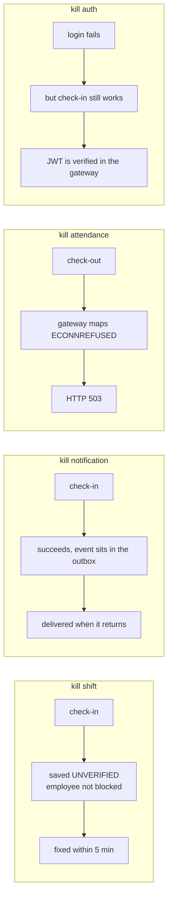
```mermaid
flowchart LR
    subgraph k1["kill shift"]
        s1["check-in"] --> s2["saved UNVERIFIED<br/>employee not blocked"] --> s3["fixed within 5 min"]
    end
    subgraph k2["kill notification"]
        n1["check-in"] --> n2["succeeds, event sits in the outbox"] --> n3["delivered when it returns"]
    end
    subgraph k3["kill attendance"]
        a1["check-out"] --> a2["gateway maps ECONNREFUSED"] --> a3["HTTP 503"]
    end
    subgraph k4["kill auth"]
        u1["login fails"] --> u2["but check-in still works"] --> u3["JWT is verified in the gateway"]
    end
```

---

## 8. Check-out

Shorter, but it shows the race-safe conditional update.

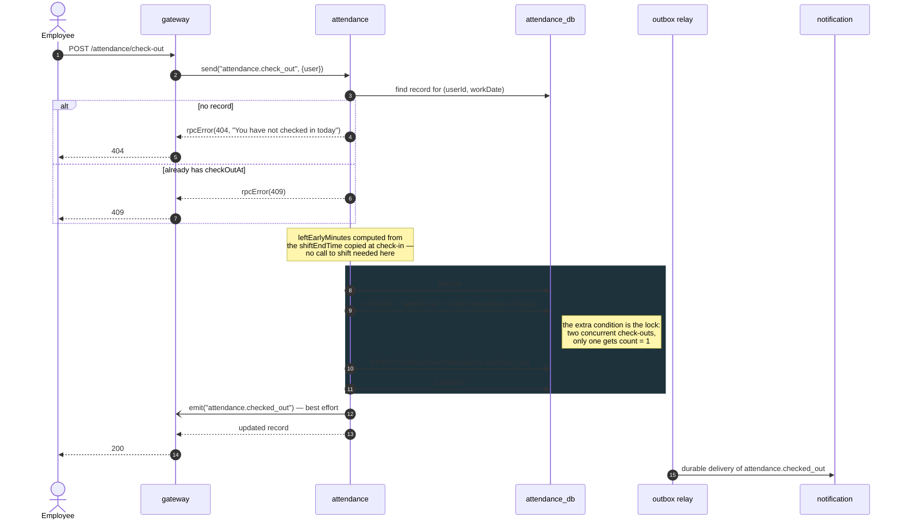
```mermaid
sequenceDiagram
    autonumber
    actor U as Employee
    participant GW as gateway
    participant AT as attendance
    participant ADB as attendance_db
    participant RL as outbox relay
    participant NO as notification

    U->>GW: POST /attendance/check-out
    GW->>AT: send("attendance.check_out", {user})
    AT->>ADB: find record for (userId, workDate)
    alt no record
        AT-->>GW: rpcError(404, "You have not checked in today")
        GW-->>U: 404
    else already has checkOutAt
        AT-->>GW: rpcError(409)
        GW-->>U: 409
    end

    Note over AT: leftEarlyMinutes computed from<br/>the shiftEndTime copied at check-in —<br/>no call to shift needed here
    rect rgb(30,50,60)
    AT->>ADB: BEGIN
    AT->>ADB: UPDATE ... WHERE id = ? AND checkOutAt IS NULL
    Note right of ADB: the extra condition is the lock:<br/>two concurrent check-outs,<br/>only one gets count = 1
    AT->>ADB: INSERT OutboxEvent (attendance.checked_out)
    AT->>ADB: COMMIT
    end
    AT-)GW: emit("attendance.checked_out") — best effort
    AT-->>GW: updated record
    GW-->>U: 200

    RL->>NO: durable delivery of attendance.checked_out
```

`shiftEndTime` was **denormalized onto the record at check-in**. Copying data at
write time is what lets a read work without calling anybody. Tradeoff: if the
shift is edited later, the stored copy is stale.

---

## 9. The live SSE dashboard

The gateway is a hybrid app: HTTP for browsers, plus a TCP listener so services
can push into it (`apps/gateway/src/main.ts`).

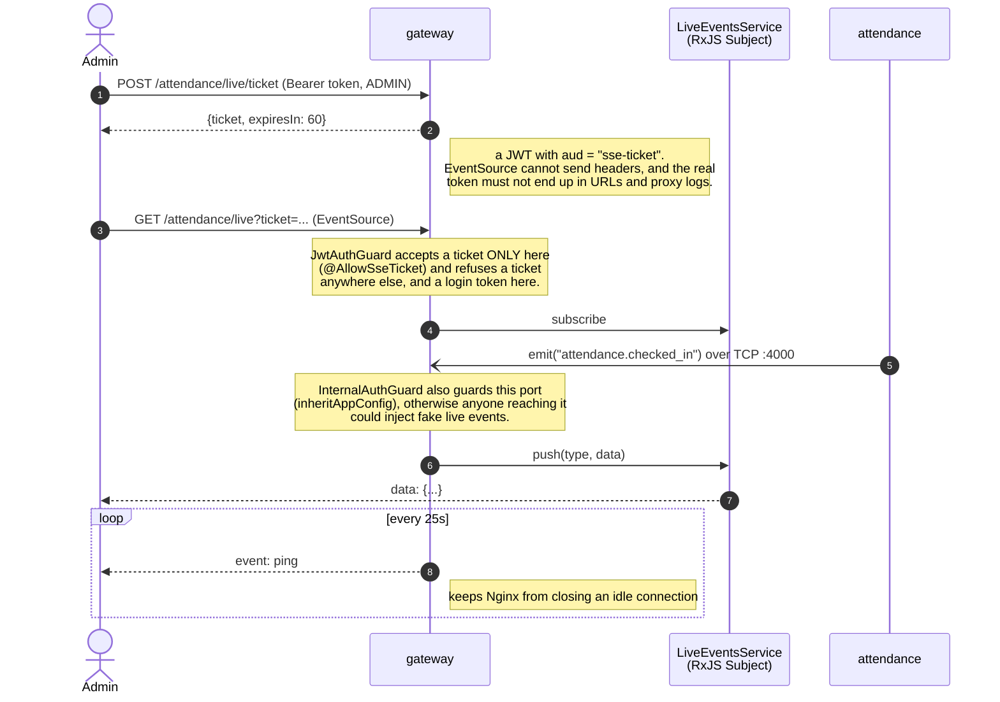
```mermaid
sequenceDiagram
    autonumber
    actor Admin
    participant GW as gateway
    participant LE as LiveEventsService<br/>(RxJS Subject)
    participant AT as attendance

    Admin->>GW: POST /attendance/live/ticket (Bearer token, ADMIN)
    GW-->>Admin: {ticket, expiresIn: 60}
    Note right of GW: a JWT with aud = "sse-ticket".<br/>EventSource cannot send headers, and the real<br/>token must not end up in URLs and proxy logs.

    Admin->>GW: GET /attendance/live?ticket=... (EventSource)
    Note over GW: JwtAuthGuard accepts a ticket ONLY here<br/>(@AllowSseTicket) and refuses a ticket<br/>anywhere else, and a login token here.
    GW->>LE: subscribe

    AT-)GW: emit("attendance.checked_in") over TCP :4000
    Note over GW: InternalAuthGuard also guards this port<br/>(inheritAppConfig), otherwise anyone reaching it<br/>could inject fake live events.
    GW->>LE: push(type, data)
    LE-->>Admin: data: {...}

    loop every 25s
        GW-->>Admin: event: ping
        Note right of GW: keeps Nginx from closing an idle connection
    end
```

**Known limit:** the fan-out is an in-memory `Subject`, so this only works with
one gateway replica. A broker (or Redis pub/sub) is the fix.

---

## 10. Gateway guard chain

Registered as global guards in `apps/gateway/src/gateway.module.ts`. Order matters.

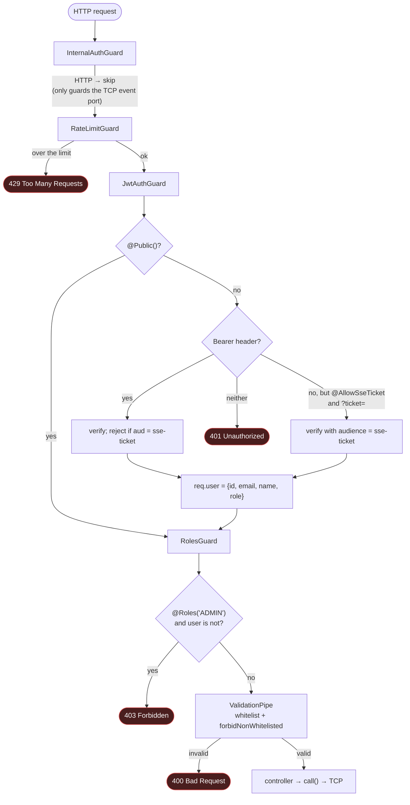
```mermaid
flowchart TB
    req(["HTTP request"]) --> g1["InternalAuthGuard"]
    g1 -->|"HTTP → skip<br/>(only guards the TCP event port)"| g2["RateLimitGuard"]
    g2 -->|"over the limit"| e429(["429 Too Many Requests"])
    g2 -->|ok| g3["JwtAuthGuard"]

    g3 --> pub{"@Public()?"}
    pub -->|yes| g4
    pub -->|no| tok{"Bearer header?"}
    tok -->|yes| ver["verify; reject if aud = sse-ticket"]
    tok -->|"no, but @AllowSseTicket<br/>and ?ticket="| vert["verify with audience = sse-ticket"]
    tok -->|neither| e401(["401 Unauthorized"])
    ver --> setu["req.user = {id, email, name, role}"]
    vert --> setu
    setu --> g4["RolesGuard"]

    g4 --> rol{"@Roles('ADMIN')<br/>and user is not?"}
    rol -->|yes| e403(["403 Forbidden"])
    rol -->|no| vp["ValidationPipe<br/>whitelist + forbidNonWhitelisted"]
    vp -->|invalid| e400(["400 Bad Request"])
    vp -->|valid| ctl["controller → call() → TCP"]

    classDef errc fill:#4a1e1e,stroke:#d94a4a,color:#fff
    class e429,e401,e403,e400 errc
```

Validate at the edge, enforce business rules inside. DTOs live in
`apps/gateway/src/dto.ts`; rules like "you already checked in today" live in the
owning service.

---

## 11. Error translation at the edge

`apps/gateway/src/rpc.ts`. Four failures that look alike but mean different things.

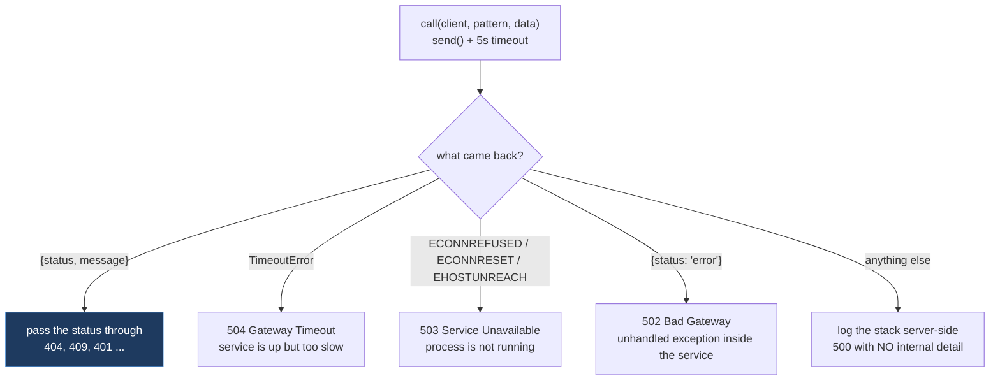
```mermaid
flowchart TB
    c["call(client, pattern, data)<br/>send() + 5s timeout"] --> err{"what came back?"}

    err -->|"{status, message}"| p["pass the status through<br/>404, 409, 401 ..."]
    err -->|TimeoutError| t["504 Gateway Timeout<br/>service is up but too slow"]
    err -->|"ECONNREFUSED / ECONNRESET / EHOSTUNREACH"| u["503 Service Unavailable<br/>process is not running"]
    err -->|"{status: 'error'}"| b["502 Bad Gateway<br/>unhandled exception inside the service"]
    err -->|anything else| i["log the stack server-side<br/>500 with NO internal detail"]

    classDef okc fill:#1e3a5f,stroke:#4a90d9,color:#fff
    class p okc
```

Errors cannot be `Error` instances across a wire, so services throw
`rpcError(status, message)` — a plain `{status, message}` object
(`libs/common/src/rpc-error.ts`) — and the gateway turns it back into an
`HttpException`.

---

## 12. Health check

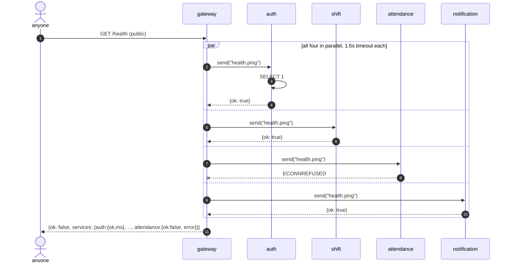
```mermaid
sequenceDiagram
    autonumber
    actor U as anyone
    participant GW as gateway
    participant A as auth
    participant S as shift
    participant AT as attendance
    participant N as notification

    U->>GW: GET /health (public)
    par all four in parallel, 1.5s timeout each
        GW->>A: send("health.ping")
        A->>A: SELECT 1
        A-->>GW: {ok: true}
    and
        GW->>S: send("health.ping")
        S-->>GW: {ok: true}
    and
        GW->>AT: send("health.ping")
        AT--xGW: ECONNREFUSED
    and
        GW->>N: send("health.ping")
        N-->>GW: {ok: true}
    end
    GW-->>U: {ok: false, services: {auth:{ok,ms}, ..., attendance:{ok:false, error}}}
```

Each service pings its own database before answering, so "up" means "up and can
actually serve", not just "the port is open".

---

## 13. Startup

What `npm run dev` does, and what each process does on boot.

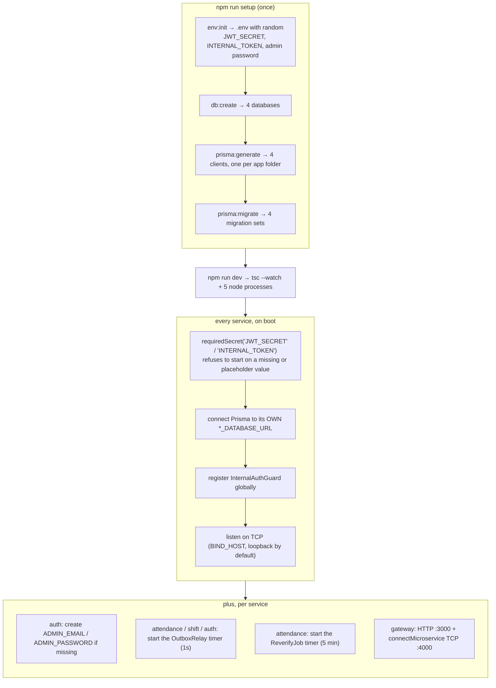
```mermaid
flowchart TB
    subgraph setup["npm run setup (once)"]
        direction TB
        s1["env:init → .env with random<br/>JWT_SECRET, INTERNAL_TOKEN, admin password"]
        s2["db:create → 4 databases"]
        s3["prisma:generate → 4 clients, one per app folder"]
        s4["prisma:migrate → 4 migration sets"]
        s1 --> s2 --> s3 --> s4
    end

    setup --> dev["npm run dev → tsc --watch + 5 node processes"]

    dev --> boot

    subgraph boot["every service, on boot"]
        direction TB
        b1["requiredSecret('JWT_SECRET' / 'INTERNAL_TOKEN')<br/>refuses to start on a missing or placeholder value"]
        b2["connect Prisma to its OWN *_DATABASE_URL"]
        b3["register InternalAuthGuard globally"]
        b4["listen on TCP (BIND_HOST, loopback by default)"]
        b1 --> b2 --> b3 --> b4
    end

    boot --> extra

    subgraph extra["plus, per service"]
        direction TB
        e1["auth: create ADMIN_EMAIL / ADMIN_PASSWORD if missing"]
        e2["attendance / shift / auth: start the OutboxRelay timer (1s)"]
        e3["attendance: start the ReverifyJob timer (5 min)"]
        e4["gateway: HTTP :3000 + connectMicroservice TCP :4000"]
    end
```

Secrets are required, not defaulted: a known `JWT_SECRET` lets anyone mint an
ADMIN token, so `libs/common/src/config.ts` throws at startup instead.

---

## Event catalogue

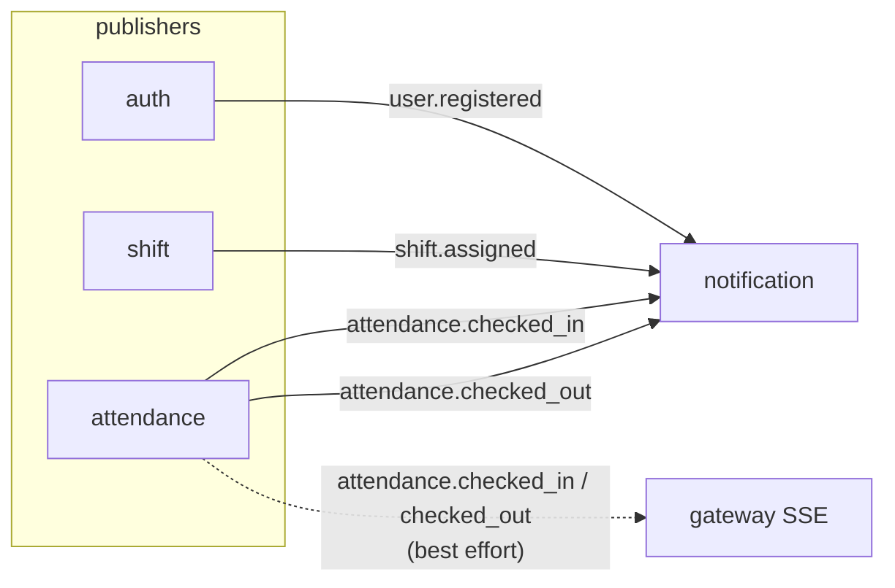
```mermaid
flowchart LR
    subgraph pubs["publishers"]
        A["auth"]
        S["shift"]
        AT["attendance"]
    end

    A -->|"user.registered"| N["notification"]
    S -->|"shift.assigned"| N
    AT -->|"attendance.checked_in"| N
    AT -->|"attendance.checked_out"| N
    AT -.->|"attendance.checked_in / checked_out<br/>(best effort)"| G["gateway SSE"]
```

| Event | Published by | Durable consumers | Payload type |
|---|---|---|---|
| `user.registered` | auth | notification | `UserRegisteredEvent` |
| `shift.assigned` | shift | notification | `ShiftAssignedEvent` |
| `attendance.checked_in` | attendance | notification (+ gateway, best effort) | `AttendanceCheckedInEvent` |
| `attendance.checked_out` | attendance | notification (+ gateway, best effort) | `AttendanceCheckedOutEvent` |

Every event is wrapped in `EventEnvelope { eventId, occurredAt, data }`.
The `eventId` is what makes retries safe.

---

## The part that is still not event-driven

`EVENT_DESTINATIONS` in `libs/common/src/events.ts` means **the publisher must
list its consumers**. That is point-to-point messaging with extra steps, not
publish/subscribe.

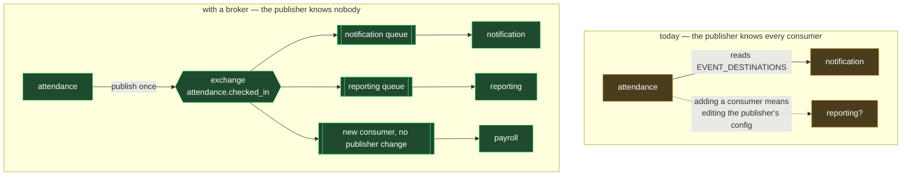
```mermaid
flowchart TB
    subgraph now["today — the publisher knows every consumer"]
        direction LR
        p1["attendance"] -->|"reads EVENT_DESTINATIONS"| c1["notification"]
        p1 -.->|"adding a consumer means<br/>editing the publisher's config"| c2["reporting?"]
    end

    subgraph later["with a broker — the publisher knows nobody"]
        direction LR
        p2["attendance"] -->|"publish once"| ex{{"exchange<br/>attendance.checked_in"}}
        ex --> q1[["notification queue"]] --> s1["notification"]
        ex --> q2[["reporting queue"]] --> s2["reporting"]
        ex --> q3[["new consumer, no publisher change"]] --> s3["payroll"]
    end

    classDef nowc fill:#4a3d1e,stroke:#d9a441,color:#fff
    classDef laterc fill:#1e4a2d,stroke:#4ad97a,color:#fff
    class p1,c1,c2 nowc
    class p2,ex,q1,q2,q3,s1,s2,s3 laterc
```

Switching is a small change in `libs/common/src/bootstrap.ts` and
`libs/common/src/clients.ts` (`Transport.TCP` → `Transport.RMQ`) plus a relay
that publishes to the broker instead of calling notification directly.
That is Week 2 in the README's learning plan.
